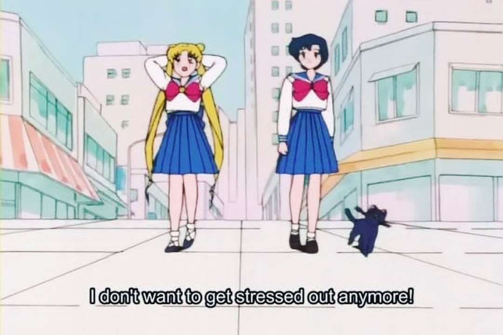
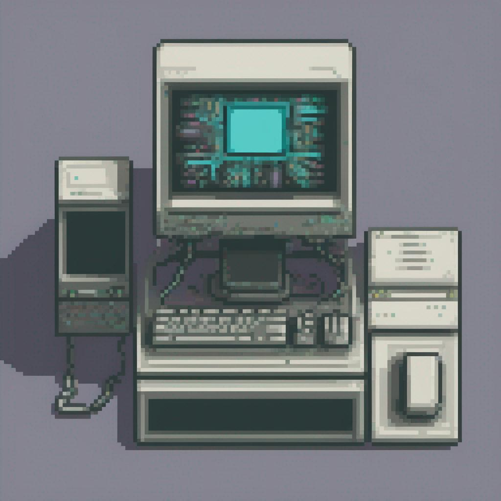
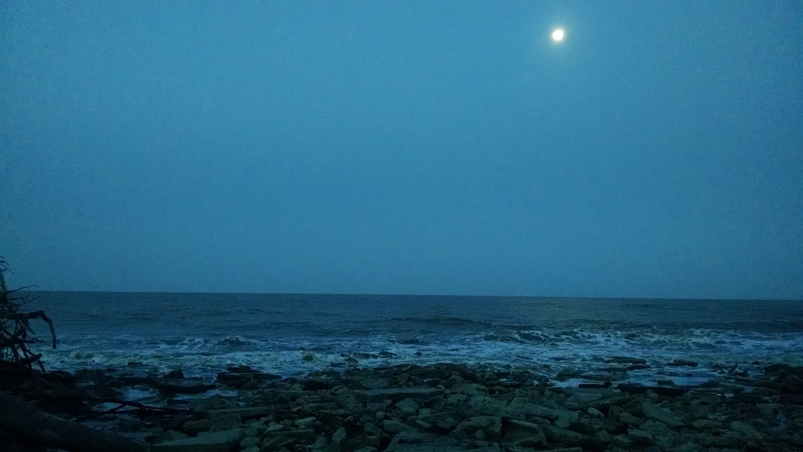

# The State of Our Online Attention

I have spent many, many, many unsatisfying hours scrolling on various social media feeds, and I don't want to do it any more. But it's hard to stop. The infinite scroll, whether it's the relatively mild vertical scroll or the overstimulating TikTok/stories/shorts scroll, siphons your attention into a frustratingly narrow space, taking away your ability to scan and filter. It is very much like a slot machine, mostly disappointment with a few glimmers of hope when you find something you actually enjoy, hinting at further enjoyment later. You only have two choices within the scroll: keep scrolling, or scroll faster. It works because it makes you forget that other options and modes of interaction exist. Just scroll. All this time adds up, and it costs you a chunk of your life.

Perhaps you and your friends have commiserated about the enshittification of search: googling isn't what it used to be. To find what we're looking for we share tricks like adding the word "reddit" at the end of our searches, because the broader internet is filled with spam. We've lost something important. Generative "AI" is flooding our searches with even more garbage: the same listicles over and over, carelessly written summaries of copies of copies.

I follow a ton of artists in the classical realism scene, and a large fraction of their posts are of them protesting against Instagram censoring their figurative work. Every once in a while, there is a new flurry of complaint when they see their viewership drop off due to some silent and unknowable change to the Algorithm. This is a deep threat to their livelihood, and it's out of their control. It's obvious to everyone that this platform is feeding off of their work, but it doesn't seem like there's any alternative.

How do we escape this thing?

# Imagining and Creating A Multiplicity of Alternatives

We can take back control over our own attention, our creative work, and our digital communities, using technology that already exists and is familiar. There isn't any one alternative, but a multiplicity of alternatives. We don't necessarily need to abandon the big social media platforms in an all-or-nothing way. Rather, we can lean into the many alternatives and find ways to meet our needs better.

Technology isn't the problem or solution here. What matters is intentionality. The state of how we connect to each other on the internet is something that just happened to us, in a sea change floated by billions of dollars, and it has slowly gotten worse and worse to the point that "social media sucks" is an uninterestingly obvious opinion. We don't have to be doomerist about it though! There are many escapes available to us.

## Chosen media feeds

Podcasts are one of my favorite types of media, and my best alternative to the doomscroll. When I don't have the energy to engage too deeply in reading or working on a project, or when I'm doing chores, I pop on a podcast. It's so much more satisfying to listen to [an audio drama](http://www.nightvalepresents.com/aliceisntdead) or [some weird story about a moral panic that was misrepresented by the media](https://yourewrongabout.com/) or [a utopian leftist sketch comedy show](https://srslywrong.com/) or [an unhinged but wholesome relationship advice show](https://radiofreetotebag.castos.com/).

Something I've unexpectedly come to love recently is using an RSS reader, and making a habit out of seeking out and adding blogs I enjoy. RSS? This sounds outdated, a nostalgic or cringy relic of the Y2K era. Just don't knock it until you tried it! We follow podcasts through an RSS feed, why not blogs? Like my podcast app, my RSS feed reader's scroll is satisfyingly finite, and it isn't trying to manipulate me with clickbait and outright rage bait. It only contains content I want to follow, and shows me posts I haven't seen before. One of the frustrating aspects of social media is that I end up seeing the same posts and memes repeated as they're re-shared, as a large chunk of the content the feed presents me. My RSS feed is rich and dense in a way that's strikingly different from any of my social media feeds. And the medium-to-long-form nature of the content across the blogs I follow just feels better to spend time with than social media content that can only last a few seconds.

## Cozy online communities

Speaking of Y2K cringy nostalgia: when I was a teen in the 2000s, watching _The Matrix_ and _Serial Experiments: Lain_ and playing Counter-Strike at basement LAN parties, I hosted a phpBB forum for my friends on a hand-me-down desktop computer that ran 24/7 in a corner of my parents' house, fan loudly spinning in its bulky beige frame. I remember spending many weeks learning the linux command line and struggling to understand the Apache HTTP server documentation.

There were a few RPG and art forums that captivated much of my time. The 2005ish version of conceptart.org happened to introduce me to the atelier movement, which shaped the last few years of my life when after a couple decades I finally got the opportunity to study figurative realism in a few atelier schools.

Now in the 2020s, creating a cozy digital space to chat with your friends is incredibly accessible. I have an uncountable number of fragmented group chats with friends that die out and occasionally come back up again.

I'm trying to catch myself before I share something to social media, and ask myself if it would be better to share in a message or Discord or whatever with the group of people I actually mean to share it to, and have a more substantial interaction. This isn't that deep, I'm mostly talking about sharing dumb jokes and memes, but at the same time the non-interaction of liking a friend's silly social media post is empty compared to getting the same silly thing in text that is meant just for you.

Filling the role of those old PHP forums, I have a few community chat spaces I love that I happened to stumble into and build relationships with those remote strangers over the years. These spaces are hard to find but so valuable when you find one that fits.

## Own your platform

Part of my inspiration for reviving my 2016 blog and writing this post among others was this concept: [POSSE - Publish (on your) Own Site, Syndicate Elsewhere](https://indieweb.org/POSSE). I came across IndieWeb and POSSE right after seeing a lot of frustrated posts from the figurative artists I mentioned earlier, whose work is being increasingly censored by Instagram after a long history of being unaccountable to artists. IndieWeb includes more technical details, but in general "publish on your own site, syndicate elsewhere" means taking control of your own platform and creative work by using social media as a tool to draw followers to your site, rather than having social media just use you.

This used to be common practice, because there wasn't really any other way to do it. People would make a WordPress site or something similar, add a mailing list, maybe an RSS feed, and own their own platform. This practice never died out, it has quietly lived on. There are tons of active blogs out there with mailing lists that are worth subscribing to, and they often syndicate out to social media.

For creators of all kinds, from personal blogs to meme-makers to artists and writers, this is a powerful approach. After overcoming the stumbling block of creating your own platform, and figuring out how to automate or make a habit out of syndicating out to other platforms, it's pretty smooth sailing.

## Own your attention

And all of us, as followers of the artists and writers and other creators we enjoy, can escape the timesuck and frustration of the endless scroll and improve the quality of our online free time. I think it's ineffective to just "cold-turkey" stop staring at the infinite scroll with nothing to replace the vacuum. There are [many different sorts of experiences of attention](https://en.wikipedia.org/wiki/Neurodiversity) out there but a lot of us need some mindless place to go and no amount of "willpower" will endure against a vacuum.

So construct that place with intention, fill it with things you love. Make a list of the things you enjoy in that mindless time: your favorite podcasts, a list of books and movies you've been meaning to spend time with, downtime music mix tapes, doodling or some similar low-stakes cozy habit. Make your RSS feed and mailing list subscriptions a rewarding place for your attention to relax into. Try as you might, you can't curate Instagram or Facebook or Twitter or TikTok or YouTube etc that way, there are too many distractions built in by a design that is trying to extract energy and money from you.

Design your own distractions, in a way that suits you.

# Third Spaces in the AFK

This is a post mostly about life online. I think most of us spend quite a decent chunk of time online, but it's not something we're comfortable admitting.

[Glitch Feminism: A Manifesto](https://www.versobooks.com/products/460-glitch-feminism) is a sort of prose-as-performance-art book I enjoyed reading with a small online book club a while back. Legacy Russell resists calling the offline world "the real world", instead using the term AFK (Away From Keyboard), because the online world **is** real, and a real place to form identities and to create, in ways that the AFK world doesn't always permit, especially for marginalized people.

A "third space" is a place for community and public life. If we count along, there's home, there's work, and there's third spaces: bars, gyms, coffee shops, makerspaces, public libraries, parks.

The digital world is the biggest and most accessible third space most of us have got. The AFK world can be sparse or even hostile when you're looking for a place to just chill and exist and be comfortable, especially if you're living in a geographical location that is expensive or difficult to travel around or maybe just doesn't have much going on.

I spend a lot of time online, and I also go to a ton of meetups and community events. Often they take a lot of energy to show up for, they aren't at all a substitute for the headspace of just browsing and relaxing that we go to the infinite scroll hoping to get. In the spirit of multiplicity, I want to bring up a nice AFK experience I had recently which kind of matches that headspace.

A "quiet book club" is a regular meeting with a "bring your own book" format. Meet in a park if weather permits or get a few tables at a cafe. Everyone chats for a bit, then reads silently for an hour, then when the hour ends we all go around and talk about what we read, we hang out, and go home. It's so low-stakes, you don't need to prepare, there's just enough structure for it to be cohesive and yet it's very relaxed. I thought it was really cool!

# Another Good Book

[How To Do Nothing: Resisting the Attention Economy](https://www.goodreads.com/en/book/show/42771901) is a wonderful rich and sprawling essay about resisting the pressures of all the toxic aspects of our culture that social media tends to amplify. I think you'll enjoy this book if you like this post, and its discussion of regionality and a connection to place is solarpunk as hell. Bring it to your next quiet book club!

# The End

There is no more to scroll past here, where you direct your attention next is up to you.

