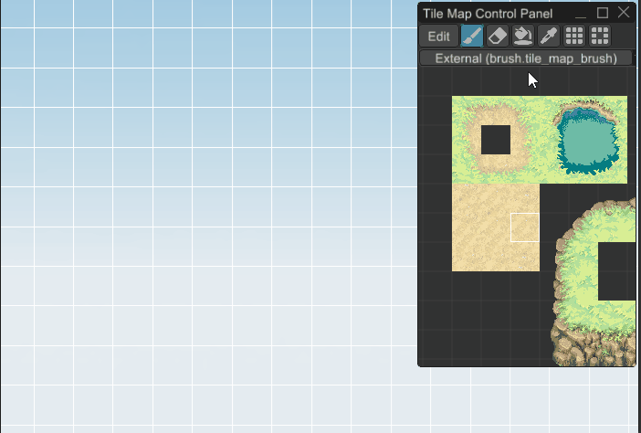
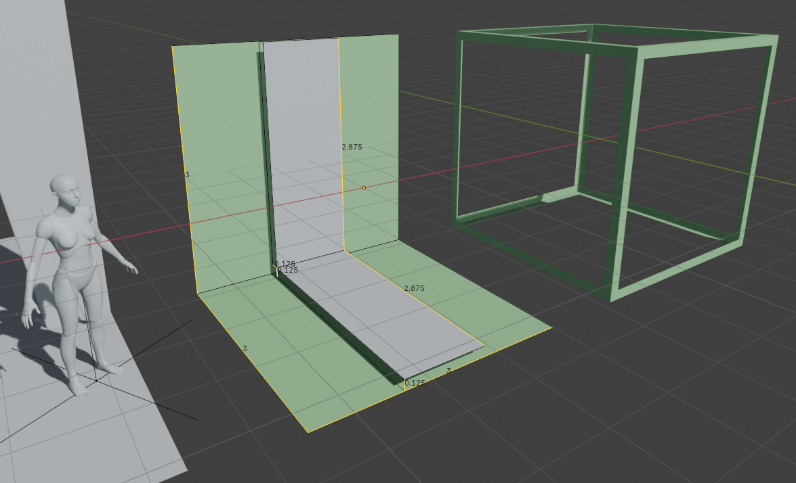
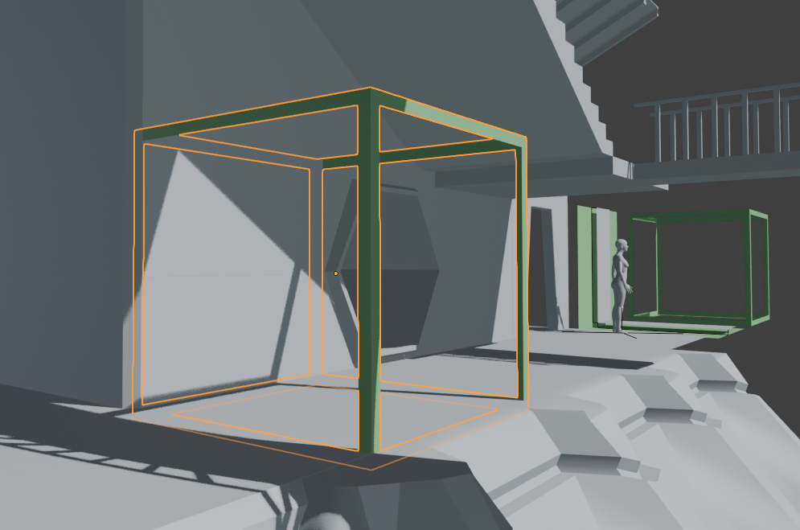
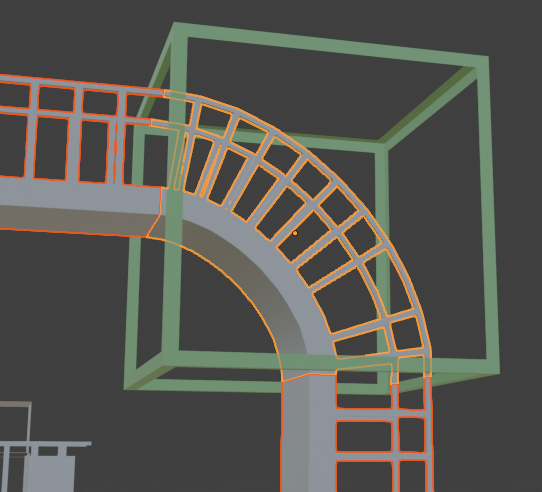
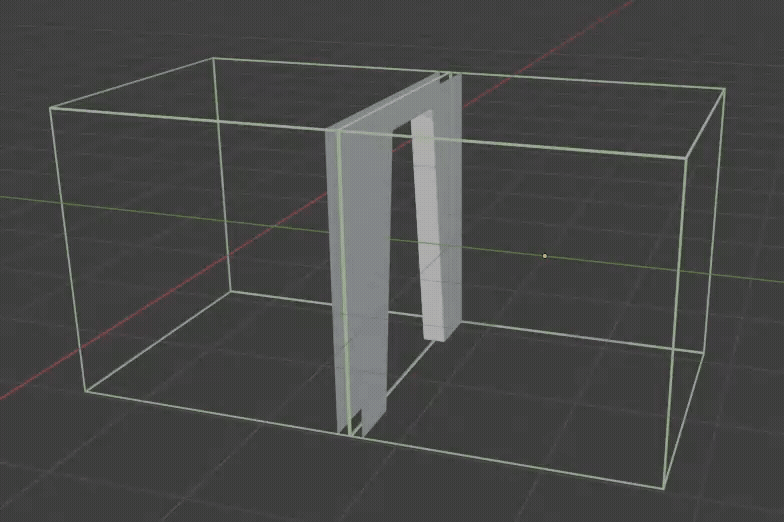
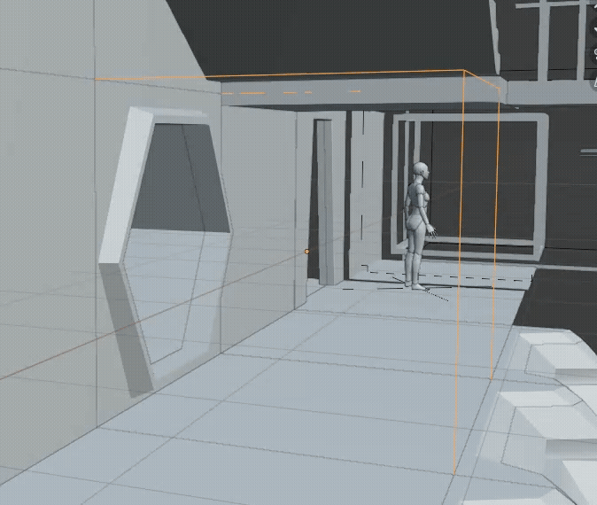
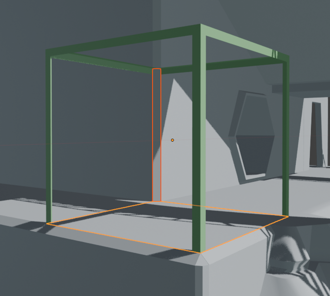
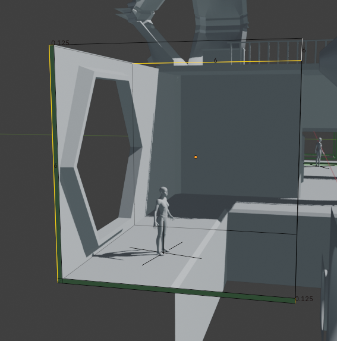
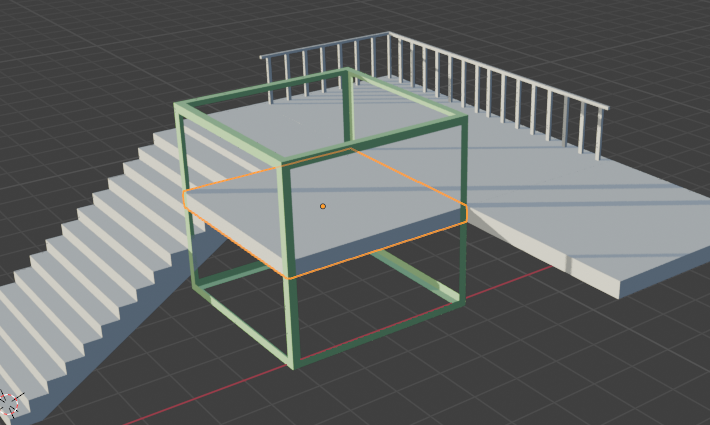
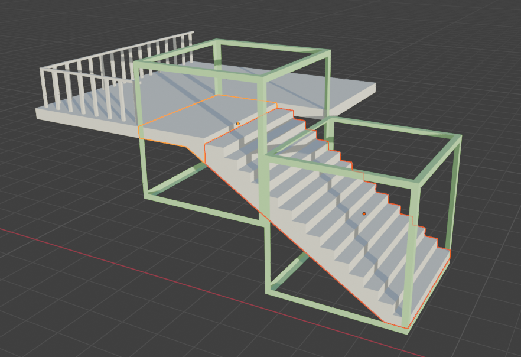

# Modular level kits for 3D games

When building 3D games, it's standard practice to have an art team make 3D models and hand those models off to level designers to arrange inside a game engine. With a well-designed kit, level designers can snap together pieces like Legos and build interesting levels without needing every part of the level custom-built and inflexible.

This is a difficult task. Graciously, several experienced game industry professionals have shared some resources. I've listed my sources below in the Resources section.

There isn't much out there about the fine details of how to go about building a level kit, so hopefully this article will be helpful.

# Outline of a geometric system

[Joel Burgess and Nathan Purkeypile](http://blog.joelburgess.com/2013/04/skyrims-modular-level-design-gdc-2013.html) describe a footprint-based system that they used for several games including Skyrim and Fallout 4. The footprint is just a 3d bounding box that every kit piece must fit into. 

It's like the concept of tilemaps in 2D games, but in 3D. Notice how you tend to need corners and mid-pieces for nice intersections. And by repeating the mid-pieces you can create long objects like this clearing and lake. (Animated GIF from [Fyrox Game Engine book](https://fyrox-book.github.io/scene/tilemap.html?highlight=slice#nine-slice-tool), a game engine written in Rust so it seems cool to me!)

Joel Burgess mentions:

> It's extremely important to note that the footprint is the full bounds of the piece, and not the traversable space of the piece. It is the imaginary grid that things line up on. Pieces always exist within the footprint. The only time a piece is at the edge of the footprint is when it is actually snapping together with another kit piece. Avoid the temptation to build to the edge of the footprint, or even worse, outside of it.

## A Visual Guide

In my design system, we expect a 2m tall player. (This seems to be somewhat standard, in Unity at least). I found that 3m seems like a useful size to design parts around -- big enough to fit a door in without getting too close to the edges, and it sets up a decent standard ceiling height for the architectural mood I'm going for. This is a subjective choice guided by blocking in various parts next to a 2m human model ([one of Blender's human base meshes](https://www.blender.org/download/demo-files/), scaled to 2m).

The footprint is just a conceptual bounding box for a kit part. Here is the footprint visualized in 2 ways. The outside of the frame box on the right is a 3m cube. On the left, the green surface is the absolute edge of the footprint. In gray, the walls/floors are floating 0.125m away from the green border.

Note the XYZ axes convention: we're facing +Y, matching Blender's "Front" orientation. (`Numpad+1` brings you into Orthogonal Front view.) It's convenient to have things with a front all facing the same way.

In this series of pictures, I'll use this green cube frame to show the footprint. When I really go to build the part, I don't use this literal cube much. But having the cube in the scene can be a useful way to check your work! It's especially useful to check if you set the object origin correctly, which you can see as a small orange circle.

Here's the footprint of an adjacent wall and floor. Once again, the wall/floor is inset from the bounds of the footprint by 0.125m in order to give the walls and floors thickness.

A complex part inside a footprint. The ends are exactly flush with the bounds of the footprint. You can check this by looking in the properties of the verticies and confirming they're at 1.5 or -1.5 in the corresponding axis (for our 3m cube footprint, the outer boundaries are 1.5m from the center).

Note that the position of the object origin here is following the half-off-center convention I'm using for free-standing panels, described below. On the flat catwalks to the left and bottom of the curved section, the catwalk platform is centered about the origin, offset by 0.125m to align with the floor and ceiling planes.

### Floor/wall/ceiling thickness

There are two big advantages to giving walls and floors (and ceilings) thickness:
1. Two walls back to back with no thickness will coincide, causing [z-fighting](https://en.wikipedia.org/wiki/Z-fighting) as they overlap each other perfectly.
2. When you make a hole in a wall/floor/ceiling, like a door or window, the wall needs thickness. An infinitesmally thin wall would look like a glitchy mistake, seeing edges of planes in 3D ruins the illusion of form and space.
 
When making a hole in a surface, the inside of the hole should extend fully to the end of the footprint. When aligned with a matching part, the inner frame will meet at the edge of the footprint and match seamlessly, as shown below.

Here is a floor and a vertical bevel between adjoining walls at an outer corner. Because the walls/floors/ceilings have thickness, you need to bridge the gap with a bevel, corner, or other shape. Since the gap is uniform, you can reuse bevels across different surfaces, as long as they have a common interface.

### Bigger footprints

What about big parts that don't fit in a 3m cube? We can make a larger footprint, and things will match up as long as the bigger footprint is a multiple of our `3m x 3m x 3m` base footprint. The object origin should still be placed in the center of the footprint, and the offset is still 0.125m for floors/ceilings/walls.

Here is a 6x6x6 footprint for a large opening.

### Free-standing panels and other exceptions

For something like a balcony, it's tedious to position a floor and then position a ceiling one footprint-unit under it. When we have a section of floor with both a top and a bottom, I think it's okay here to keep the origin in the center rather than choosing below the ceiling or under the floor. However, if you want to have the ability to mix-and-match different floors and ceilings, you might as well keep them independent and have them offset by 0.125m from the bottom and top of the footprint respectively.

I ran into another exception with these stairs. Notice that the stairs themselves because of their slope don't quite fit into a footprint, and need to align with floating floor panels. You can see that the footprint cube is offset by half its height (`3m / 2 = 1.5m`) to match up with the way I've aligned the floating floor panels.

Is this breaking the geometric rules of the footprint system? The Joel Burgess Skyrim article says:

> Level designers tend to build on a grid snap setting of one-half the size of the footprint.

So I hope that hints at the need to sometimes switch between aligning to the face and other times aligning to the central body.

The stairs arrangement might here end up being a bad design for the kit. More experimentation is needed...

## Design standards for the system I'm using

FOOTPRINT: A **3m cube** looks good for a typical window, doorway, and ceiling relative to a 2m character.
- Many parts will fit in a single footprint. But a tall pillar might be 2 or 3 footprints tall (6m or 9m respectively). As illustrated in the tilemap animation from before, you can often avoid setting the heights of longer parts by making a middle part that tiles and one or more end caps.
- In Unity, when snapping parts to the level, you should therefore use a 1.5m grid to allow for half-sizes and half-offsets.

PART ORIGIN: The object origin should be the **center of the footprint bounding box** for each part. This is generally NOT the center of the volume or mean vertex position -- you have to be aware of the footprint you're building in and place the object origin so it's equidistant from sides of the footprint bounding box. In most of the 3D images above, you can see the part origins visualized as orange circles.
- As pictured above, free-standing panels are an exception to this, they can have the origin centered between in the floor/ceiling or wall/wall planes.
- *Why a center origin? It allows the parts to be freely rotated without having to move them after the rotation. If the origin was in a corner or the center of an edge, rotating a part about a corner moves its center. That can be confusing and annoying, especially since I'm trying to support a game where levels don't have a fixed universal "down"/"floor". If I didn't have that concern, the origin could be on the "ground" in the center, or in the center of the edge where the ground meets a wall, which afaik are conventional in modular level kits.*

STANDARD FLOOR/CEILING/WALL WIDTH: **0.125m**. One subgrid unit (0.25m, below) is good for many things but since walls/floors are back-to-back, that would mean 0.5m total, which is visually too thick. So our standard width for thicknesses is **0.125m** set in for each piece. That means in a 3m cube footprint, any axis-aligned flat surfaces (floor/ceiling/wall) should be 0.125m away from the matching plane of the footprint cube. Unless they're a corner part or pillar, they should generally run all the way to the end of the footprint flush against the edge of its bounding box.

MARGIN: When you print a document, it's good to leave a margin so that nothing will get cut off. Similarly, when making a panel that might end up intersecting a perpendicular wall/floor/ceiling/etc, it's good to leave a margin so that when you add that wall/floor/ceiling, it doesn't clip your new panel in an ugly way.

SUBGRID: **0.25m** optional grid. The subgrid is a finer-resolution grid that is optional to use as appropriate. It should be used to align things like trim, recesses, inset panels, and so on, across pieces. Given that the footprint is a 3m cube, 0.25m grid units is nice because it's 1/12 the cube. 12 is a convenient number, it gives us the ability to align to the grid evenly with many fractions of the footprint: 1/12, 1/6, 1/4, 1/3, 1/2.
- The subgrid isn't a strict rule. It's OK to use half of the subgrid resolution `0.25m * 1/2 = 0.125m`, when needed (like the wall/floor/ceiling width), but try to stick to 0.25m when you can for things like trim or railings that need to line up with adjacent parts.

GREEBLES: Stuff like keypads, small vents, debris, and other non-integral detail bits don't need to be placed in a footprint. It's often nice if their main dimensions can line up with the grid when possible. It's usually most convenient to put their object origin on the center of whatever surface snaps up against the wall. A table's origin could be the center of its bottom plane so it snaps to the ground, a light switch's origin would be the backmost plane where it's flush with a wall, a ceiling lamp's origin would be the top where it snaps on to a ceiling.

CHARACTER DIMENSIONS
- 2m tall
- Can step up 0.2m vertically. Anything higher requires jumping.
- (TODO finalize minimum traversable width)
- (TODO standard jump height?)
- No crouching, if we had crouching it would be important to note the smallest frame you could traverse crouched.

### Summary:

- The footprint is a bounding box of an exportable part. It should be in multiples of a 3m cube: 3x3x3, 6x6x6, etc. Even if there's a lot of empty space, I'm not sure if it's a bad idea to do non-cubical footprints like 6x3x3.
	- Tip: to make sure the origin is reasonable at a rotation point, try rotating the object 90 degrees in different axes and make sure it winds up aligned with a 90 degree oriented "wall" without translation.
- Walls/floors/ceilings/etc, in other words planes that are coplanar with a side of the footprint box, should be 0.125m away from their side of the box. Since the origin is the center and the side of the box is 1.5m, that means they should generally be at 1.375 in whatever axis they're perpendicular to (`1.5m from center to edge of 3m cube - 0.125m in from the edge = 1.375m from the center`).
- In general, leave a 0.125m margin around walls/floor/ceiling panels because that's where other panels will often fall. However, you should scale the plane out to exactly meet the edges of the bounding footprint -- just be aware that adjacent 90-degree panels can intersect into that margin area.
- The subgrid isn't a hard rule, but just a suggestion to make things line up and be more cross-compatible. The grid is 0.125m. But when you can, try to stick to 0.25m increments when so things match up more easily.

# TODO needs to be edited

## Local grids

TODO explain, tilt object and continue with that new grid, multiple rotations of grids can be present in a scene, eg two streets that make a non-perpendicular X.

## Interfacing

**Interfaces** are my term for the area where two kit pieces match up

TODO: examples, seamless, problems updating, using frames and gaps to break up, AToB seam transitions, naming conventions

## Pivot-and-flange

TODO. Pillar, archway, etc disguises bad interfaces, it's an easy hack.

## Texture concerns

The proof pieces have no texture

Textures that are meant to tile across kit pieces

TODO: define texel density

Texel density should be uniform. Don't be too conservative, you can always downsample textures easily, while upsampling is generally labor-intensive.

## Kit hierarchy

These are my terms, I'm attempting to name things I saw in the Fallout 4 GDC talk where they shared some learnings about making kit pieces more mix-and-match-able.

**Template Proofs** These are featureless or nearly-featureless objects useful to build atoms. For example, a standard doorway block-ins. These are just helpful tools for 3d artists to get started on kit pieces faster because there's minimal geometry and correct dimensions. They can be exported as a **"proof kit"** so that level designers can give 3d artists early feedback about whether the big ideas of the kit are working.

**Atoms** are not exported to the game editor, they're only in used 3d modeling software to compose parts. They're too tiny to be useful to a level designer, it would be a lot of work to assemble them into something. Atoms could include door handles, wall ornamentation, a part of a window that is reused, etc. It can be a good idea to put them in a library for the convenience of the 3d artists, but be careful changing them, it's always safer to duplicate.

**Molecules** are the smallest parts that are exported to the game editor. They're a bit big enough to be useful to a level designer. The chemistry metaphor isn't perfect -- molecules here are not necessarily made up of atoms, they can be made from scratch.

**Compounds** Molecules arranged together in a way that is useful. For example, if you have an arrangement of a floor, trim, wall, and column that fit together in a way that makes sense to repeat, you can group it as a compound. In Unity, compounds are probably best arranged as Prefabs that compose other "molecule" Prefabs.

For the exported pieces, a good rule is to make big objects less granular than small ones. For example, a kit for building a city can have pieces that are whole facades or entire buildings. A kit for building a hallway can have small wall panels and individual doors. If it's too granular, it's tedious to work with in the Editor.

## Naming

TODO `[Kit Name].[Subkit Name].[???].[Mid/Bevel/Cap].[UniqueDescriptionOrLetter][L/R if mirrored][VersionNumber]`

- "CornerIn" is an inside corner, the corner of a room. "CornerOut" is an outside corner that goes the other way, like on the outside of a building.
- "BevelFull" "BevelHalf"
- Use letters not numbers, except for versions if you need to do versioning.
- Kit and subkit examples. Remember the Fallout 4 lesson that "Utility hallway" was really just useful for its pipes, if the walls are the same just make a pipe kit.

# Resources

- [Skyrim’s Modular Approach to Level Design](http://blog.joelburgess.com/2013/04/skyrims-modular-level-design-gdc-2013.html)
- [The Iterative Level Design Process Used to Ship Fallout 3 and Skyrim](http://blog.joelburgess.com/2014/07/gdc-2014-transcript-iterative-level.html)
- [The Modular Level Design of Fallout 4](https://gdcvault.com/play/1023202/-Fallout-4-s-Modular)
- [Beyond Extent - Modular Kits for Game Environments w/ Jon Arellano](https://www.youtube.com/watch?v=77xPHfzciiY)

---

# Appendix

This is the end of the actual article, below is just unpolished notes.

## My notes from "Skyrim's Modular Level Design" talk

- Repeated detail elements bother players. Repeated architecture is more forgivable.
- You can kitbash your own kits together in combinations that aren't intended for interesting environments
- You have to be carefully making changes to a kit, because it has wide effects across the instances
- For normal doors, standardize the dimensions. Then you can mix and match doors, reuse logic etc
- Also figure out the minimum traversable width of the player (and double it) for the narrowest sections
- Know what the max traversable incline is (and if it's too high and looks weird)
- Know any other gameplay-related dimensions: for a platformer, how far can you jump? For a shooter, how high a fence can you shoot over, how low a barricade can you take cover under?
- Kits can be organized into sub-kits, like "Small Room", "Small Hallway".
- Begin with greyboxing the kit.

> What is the visual theme of the kit? How is it different from other areas in the game? What kinds of spaces do you want to build with it?  How will be it be used?  How often will it be used? Some of these answers will be driven by design, others by art - it's important that both voices are being represented from the very beginning. [...] How widely-used will the kit be?

> We get our kits to a "functional-but-ugly"" state as soon as possible.

> **Proof pieces** have almost no mesh detail and usually no textures at all. Instead, we'll be playing with proportions, kit logic, naming conventions, and other basic needs. Because of that, this stage of the process is also relatively quick, often only 1-3 weeks, depending on the scope of the kit, and how many failed iterations of the proof pieces end up being created and disposed of.

> If you want to build an asymmetrical cave kit, start building obvious asymmetry into the graybox pieces. If you make your graybox too generic, you do not actually solve any problems.

Stress testing: level designers (and artists making the kit) try matching up the pieces and see if they work together in different configurations.
- Loop the kit back on itself. A flawed design might not re-align with itself if you make a hallway or wall loop.
- Stack it on top of each other. Does it overlap itself?
- Try making pillars out of things that aren't meant to be pillars.

> Avoid attempting to create a kit which tiles on all axes.  Hallways kits tend to tile on only one axis, while rooms typically tile on two.  An all-axis tiling kit is able to create spaces which stretch out not only horizontally, but also vertically stack and tile on themselves.  This kind of kit allows a great deal of building freedom, but is very complex to build and use.  When vertical tiling is desired, it's generally wiser to build a separate sub-kit with a fixed horizontal plane size.

## Unfinished weird ideas

### Non-cuboidal footprint

What if you want to build a really geometrically unusual environment where there is no constant gravity, where you want to fully and equally use multiple planes as "the ground", and lose the distinction between walls versus ceilings versus floors? Typical kits are very unidirectional with a clear up and down.

Normally, kits use cubes or rectangular prisms as the footprint. These shapes work well because cubes and rectangular prisms are a space-filling geometry. In other words, cubes tesselate in a 3D space and leave no gaps.

Another convenient feature of the cube is that it tesselates without rotation. Some space-filling 3D shapes need to be rotated in complex ways, which would make them difficult to use.

Some shapes are not space-filling on their own, but in combination with other shapes can fill space. That might be okay, if it's not too intricate a pattern.

Cubes are familiar to us, most rooms are shaped like a box and fit into cube shapes. So we don't want a system based on a footprint that is incompatible with a cube. What can coexist with cubes, is space filling, and doesn't require complex rotations to match up?

Any 2D tesselation can be extruded to make a 3d tesselation. But these all have the same problem: they end up being flat on the "top".
- A triangular prism (extruded triangle, ie cube cut in half diagonally on one axis) can interface with a cube on its rectangular sides and is space-filling without rotation. This would be a promising one but it's very acute and makes sharp corners, and is so similar to a cube that it doesn't give us much new geometry.
- A hexagonal prism is more interesting. It gives us roomy corners, and its square sides easily interface 

Parallelipeds are sort of a lopsided cube, a square is to a parallelogram as a cube is to a paralleliped. It tesselates just like a cube, but with two opposite faces tilted at some angle. It doesn't get us very far, we've just tilted one axis (linear transformation).

Octahedrons (or in RPG dice terms, d8) and tetrahedrons (d4) can tesselate. This can make a collection of interesting shapes. However, equilateral triangle faces are too acute for the basis of a footprint system.

A truncated octohedron seems interesting because I think it aligns with the normals of a cube and of a tetrahedron / octahedron.

For special cases, a truncated icosahedron is interesting, or other [Goldberg polyhedrons](https://en.wikipedia.org/wiki/Goldberg_polyhedron). Hexagons and pentagons are nice face shapes. I think there's some directionality to them which might be constraining, eg the dihedral angle of a truncated icosahedron between adjacent hexagonal faces is ~138.18°, and pentagon to hexagon dihedral is about 142.6°. That is just a few degrees though, so maybe it wouldn't enforce an even-odd edge pattern to the hexagons. And maybe an even-odd edge pattern would look cool.

### Deep Space Hallucinations

It is interesting to think about crystal structures, [space frames](https://en.wikipedia.org/wiki/Space_frame), [3d honeycombs](https://en.wikipedia.org/wiki/Honeycomb_%28geometry%29) that tesselate space, [point groups](https://en.wikipedia.org/wiki/Point_groups_in_three_dimensions), the [17 wallpaper groups](https://en.wikipedia.org/wiki/Wallpaper_group) , and finding the perfect set of angles that make a flexible kit that doesn't tend to orthogonality even in the vertical axis. But in pursuit of this geometry, you can end up in outer space.

[Geometry of Thinking](https://geometryofthinking.com/2023/08/05/tensegrity/)

> "All structures, properly understood, from the solar system to the atom, are tensegrity structures. **Universe is omnitensional integrity**"
—R. Buckminster Fuller, Synergetics, 700.04

> "Tensegrity" is a portmanteau of tension and integrity. It refers to standalone structures that would have **as much integrity in the vacuum of space as on the earth’s surface**.

> Wallpaper group `p2`, a ceiling of an Egyptian tomb